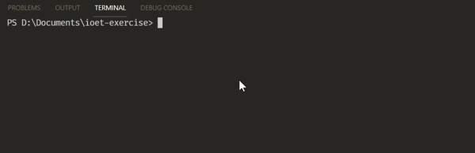

<div align="center">

# Ioet Exercise

</div>

<p align="center">
  <a href="https://devlibrary.withgoogle.com/products/android/repos/skydoves-pokedex"></a>
</p>


<div align="center">
  
  ## Overview
  
</div>

<p align="center">
  This project was developed as a part of ioet recruitment process to provide a solution to know what employees have been at the office within the same time frame.
</p>

## Exercise

<p>
The company ACME offers their employees the flexibility to work the hours they want. But due to some external circumstances they need to know what employees have been at the office within the same time frame
</p>
<p>
The goal of this exercise is to output a table containing pairs of employees and how often they have coincided in the office.
</p>
<p>
Input: the name of an employee and the schedule they worked, indicating the time and hours. This should be a .txt file with at least five sets of data. You can include the data from our examples below:
</p>

### Example 1:

#### INPUT
```
RENE=MO10:00-12:00,TU10:00-12:00,TH01:00-03:00,SA14:00-18:00,SU20:00-21:00
ASTRID=MO10:00-12:00,TH12:00-14:00,SU20:00-21:00
ANDRES=MO10:00-12:00,TH12:00-14:00,SU20:00-21:00
```

#### OUTPUT:
```
ASTRID-RENE: 2
ASTRID-ANDRES: 3
RENE-ANDRES: 2
```

### Example 2:

#### INPUT:
```
RENE=MO10:15-12:00,TU10:00-12:00,TH13:00-13:15,SA14:00-18:00,SU20:00-21:00
ASTRID=MO10:00-12:00,TH12:00-14:00,SU20:00-21:00
```

#### OUTPUT:
```
RENE-ASTRID: 3
```

## Solution Overview
The proposed solution was developed in python v3.7.9 as follows:
* Two classes were implemented, Employee and Schedule.
* The information was extracted from the txt file and stored as a list of employees.
* Then the list was iterated and the employees' schedules were compared in pairs to determine how often they have coincided in the office, this information was stored in a dictionary to later be displayed on the console.

## Instructions to run the project locally
### Run the program

#### Run the following command in your working directory.

```
python3 main.py
```

#### Input
```
RENE=MO10:00-12:00,TU10:00-12:00,TH01:00-03:00,SA14:00-18:00,SU20:00-21:00
ASTRID=MO10:00-12:00,TH12:00-14:00,SU20:00-21:00
ANDRES=MO10:00-12:00,TH12:00-14:00,SU20:00-21:00
JULIO=MO11:00-13:00,TU11:00-12:00,TH01:00-03:00,SA14:00-18:00,SU19:00-20:00
LORENA=MO09:00-11:00,TH10:00-12:00,SU20:00-21:00
```

#### Expected Output
```
RENE-ASTRID: 2
RENE-ANDRES: 2  
RENE-JULIO: 4   
RENE-LORENA: 2  
ASTRID-ANDRES: 3
ASTRID-JULIO: 1 
ASTRID-LORENA: 2
ANDRES-JULIO: 1 
ANDRES-LORENA: 2
JULIO-LORENA: 0
```



### Run tests

#### Run the following command in your working directory.

```
python3 tests.py
```
#### Expected Output
```
Ran 4 tests in 0.005s

OK
```